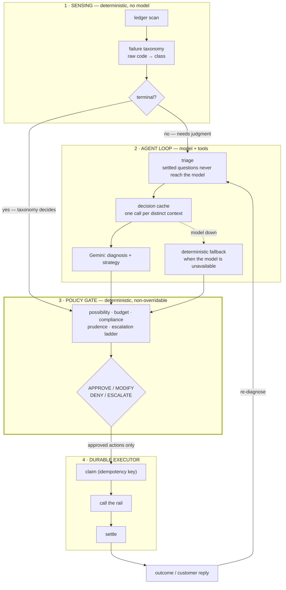
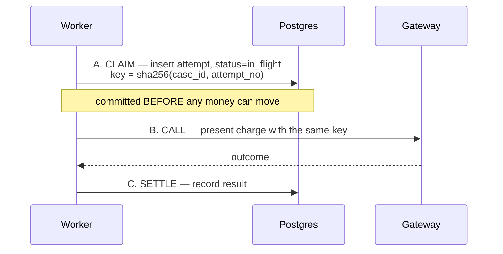

# SALVAGE — architecture

> All payment data in this system is **simulated**. See the README for what that means
> and what it does not.

## The shape of the problem

A failed recurring payment is not a retry problem. It is a bounded decision problem under
cost, compliance, and customer-patience constraints. The architecture follows from that
sentence: something has to *notice*, something has to *judge*, something has to *refuse*,
and something has to *act exactly once*.

Those are four different jobs with four different correctness criteria, so they are four
layers.

The double border on layer 3 is the point. **Nothing reaches the executor that the gate
did not return.**

## Why the layers are split this way

### Layer 1 keeps the model off the ledger

Classification is a lookup table. Running a language model over every failed charge to
learn that `SIM_MANDATE_REVOKED` means the mandate was revoked would be slow, expensive,
and less reliable than a `Map`. Layer 1 is deterministic and cheap; only cases that
genuinely require judgment reach layer 2.

On the seeded 300-case cohort, **~38% of decisions never reach the model at all** — the
taxonomy already knows the answer.

### Layer 2 does judgment, and *only* judgment

The division is enforced in code, not by convention:

| The model supplies | Code supplies |
|---|---|
| a diagnosis | when the next inflow date falls |
| one of nine named strategies | how many hours that is from now |
| whether to also notify | what each action costs |
| a rationale | the expected value of each option |
| | whether an action fits inside the horizon |

The model is never asked *"retry in how many hours?"* It is asked *"should this wait for
the customer's money to arrive?"* Calendar arithmetic and expected-value arithmetic are
things code does correctly every time and a model does approximately.

Three mechanisms keep the model's cost bounded, and all three matter:

1. **Triage** — settled questions never asked.
2. **Cache** — a class-conditional context signature, storing the *in-flight promise* so
   concurrent cases with one signature make one call rather than twelve.
3. **Fallback** — a deterministic policy takes over when the model is unavailable, so a
   congested API degrades quality instead of stranding cases.

### Layer 3 is the one that cannot be argued with

A guard rail implemented as a prompt instruction is a *request*. The gate is a pure
function of the case and the clock: no model, no probability, no discretion. It applies
to **both arms** — it is enforcement, not a feature of the agent.

Rules are evaluated in a deliberate order: **abort** (a captured payment stops everything)
→ **possibility** (terminal class, over cap) → **budget** (attempts, contacts) →
**compliance** (pre-debit notice, quiet hours) → **prudence** (open breaker, live promise)
→ **ladder** (tone advances one tier at a time).

Every rejection records the *name* of the rule that fired. "Blocked by policy" with no
rule name is an assertion; a rule name is evidence.

### Layer 4 assumes it will be killed

Crashing in each window is survivable:

| Crash point | What happens |
|---|---|
| before A | nothing happened; the job reruns and claims cleanly |
| between A and B | claim exists as `in_flight`, the rail never saw it; the reclaimer calls with the same key |
| **between B and C** | **the dangerous one.** The rail may have charged and we have no record. The reclaimer does *not* re-decide — it re-presents the same key, and the gateway returns the original outcome from its ledger without charging again |
| after C | the claim is settled; the reclaimer reads it and returns it unchanged |

The guarantee does not rest on the worker being careful. It rests on a `UNIQUE` constraint
plus a gateway that honours idempotency keys — both of which hold while the process is
dead.

## Where each guarantee actually lives

None of these are application conventions. They are constraints, and constraints hold
during a crash:

| Guarantee | Enforced by |
|---|---|
| Never double-charge | `charge_attempts.idempotency_key UNIQUE` |
| Redelivered webhook is a no-op | `inbox.razorpay_event_id PRIMARY KEY` |
| One retry budget per billing cycle | `UNIQUE (subscription_id, cycle_id, arm)` |
| Two workers cannot both advance a case | `version` + `WHERE version = $n` |
| Audit trail cannot be rewritten | `BEFORE UPDATE/DELETE` triggers |
| State and event log cannot diverge | both written in one transaction |

## Determinism, and why it is engineered rather than hoped for

Two distinct randomness facilities, and the distinction is the reason the control-vs-agent
comparison means anything:

- **`Rng`** — a sequential seeded stream, used *only* to build the population.
- **`uniform(...)`** — an **order-independent** hashed draw, used for *every* environment
  outcome. Its value is a pure function of `(seed, subscription, timestamp, purpose)` and
  not of how many draws preceded it.

A single shared sequential stream would silently de-synchronise the two arms the moment
their action sequences diverged, and the comparison would be worthless.

This is what makes the cross-validation possible: with circuit breakers off, the durable
Postgres+queue engine reproduces the in-memory engine **exactly** — same outcome, same
attempt count, same closing timestamp, for every case.

## What is real and what is simulated

| Real | Simulated |
|---|---|
| Postgres 16, Redis 7, BullMQ | the payment gateway and its ledger |
| The worker containers, and the `SIGKILL` | customers, banks, mandates, decline codes |
| HMAC webhook verification | bank outages and liquidity |
| Gemini API calls | customer responses to re-mandate links |
| The RBI parameters (sourced, cited) | every cost and probability assumption |

## Stack, and what was deliberately left out

TypeScript on Node 24, run by native type stripping — no build step. Postgres for durable
state. Redis + BullMQ for delayed jobs, stalled-job reclaim, and the DLQ. `node:http` and
`node:crypto` for webhook ingress. Gemini via `@google/genai`.

**Rejected on purpose:** ORMs, Express/Nest, agent frameworks, React, vector databases.
Razorpay's stated criteria penalise "forcing unnecessary tech stacks," and each of those
would have added a dependency without adding a capability this system needs. Phase 1 runs
with **zero runtime dependencies** and no database at all.

The one thing worth saying plainly about the queue: **BullMQ does not provide the
never-double-charge guarantee.** It provides delayed jobs, stalled-job recovery, and a
DLQ. The queue is at-least-once by design; the durable layer is what makes at-least-once
safe.
